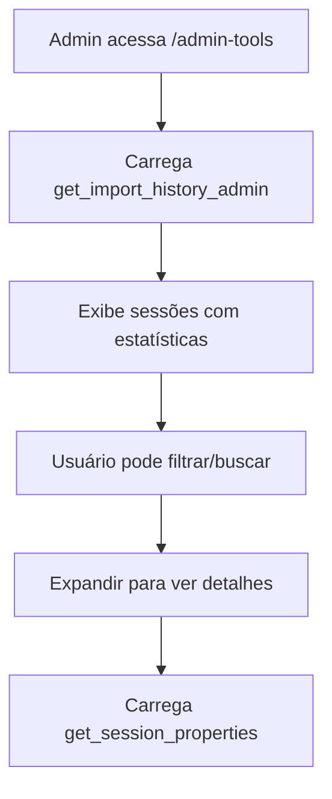
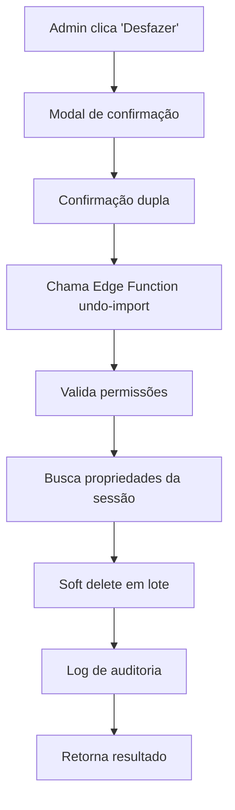

# Sistema de Administração Avançada - Histórico de Imports

## Visão Geral

Sistema exclusivo para administradores com funcionalidades avançadas, começando com histórico completo de importações e capacidade de desfazer imports realizados por usuários.

## Funcionalidades Principais

### 🎯 **Página de Administração Avançada**
- **URL**: `/admin-tools`
- **Acesso**: Exclusivo para role "admin"
- **Sidebar**: Nova entrada "Admin Tools" para navegação

### 📊 **Histórico de Imports**
- **Visualização Completa**: Lista todas as importações realizadas no sistema
- **Dados Detalhados**: Usuário, data/hora, quantidade de propriedades, taxa de sucesso
- **Filtros Avançados**: Por usuário, período, termos de busca
- **Detalhes Expandíveis**: Visualizar propriedades específicas de cada import

### 🔄 **Funcionalidade Desfazer Import**
- **Ação Segura**: Soft delete de todas as propriedades de uma sessão específica
- **Confirmação Dupla**: Modal com detalhes completos antes da ação
- **Auditoria Completa**: Log detalhado de todas as ações administrativas
- **Reversibilidade**: Propriedades são marcadas como deletadas, não removidas fisicamente

## Arquitetura Técnica

### **Frontend**
```typescript
// Página principal
AdminTools.tsx - Interface completa com tabs e funcionalidades

// Componentes integrados
- ImportHistory: Visualização do histórico
- UndoImportModal: Modal de confirmação
- Filtros avançados: Busca, data, usuário
```

### **Backend - RPC Functions**
```sql
-- Buscar histórico agregado de imports
get_import_history_admin() 
RETURNS TABLE (
  import_session_id, user_id, user_name, created_at,
  total_properties, success_count, error_count, status
)

-- Buscar propriedades específicas de uma sessão  
get_session_properties(session_id text)
RETURNS TABLE (
  id, name, owner_name, cidade, created_at, deleted_at
)
```

### **Backend - Edge Function**
```typescript
// Edge Function: undo-import v1
- Autenticação: Verificação de token Bearer e role admin
- Validação: Busca propriedades da sessão via RPC
- Ação: Soft delete em lote das propriedades ativas
- Auditoria: Log completo da ação administrativa
- Resposta: Feedback detalhado do resultado
```

### **Database**
```sql
-- Melhorias na tabela properties
ALTER TABLE properties ADD COLUMN import_batch_id TEXT DEFAULT NULL;
CREATE INDEX idx_properties_import_batch_id ON properties(import_batch_id);

-- Tabelas existentes utilizadas
- import_logs: Rastreamento de sessões de import
- properties: Propriedades com soft delete
- audit_logs: Auditoria de ações administrativas
- users: Dados dos usuários para relacionamento
```

## Fluxo de Funcionamento

### **1. Visualização do Histórico**


### **2. Desfazer Import**


## Segurança Implementada

### **🔒 Controle de Acesso**
- ✅ Rota protegida apenas para role "admin"
- ✅ Verificação de token JWT em Edge Function
- ✅ Validação de role no backend
- ✅ Sidebar visível apenas para admins

### **🛡️ Auditoria Completa**
- ✅ Log de todas as ações de desfazer imports
- ✅ Rastreamento de usuário administrativo
- ✅ Timestamps precisos das ações
- ✅ Dados completos: session_id, propriedades afetadas

### **⚠️ Segurança das Ações**
- ✅ Confirmação dupla obrigatória
- ✅ Preview completo antes da ação
- ✅ Soft delete (não remoção física)
- ✅ Validação de propriedades ativas

## Interface do Usuário

### **🎨 Design Responsivo**
- **Cards Expandíveis**: Visualização organizada das sessões
- **Badges de Status**: Indicadores visuais de sucesso/falha
- **Filtros Intuitivos**: Busca por usuário, data, termos
- **Modal Profissional**: Confirmação clara com avisos de segurança

### **📱 Mobile-First**
- **Layout Adaptável**: Funciona em todos os dispositivos
- **Navegação Simplificada**: Tabs para organizar funcionalidades
- **Feedback Visual**: Loading states e confirmações

## Dados e Estatísticas

### **📈 Métricas Apresentadas**
- **Por Sessão**: Total de propriedades, sucessos, erros
- **Por Usuário**: Histórico completo de atividades
- **Status Geral**: Completo, parcial, falha, desfeito
- **Timeline**: Ordenação cronológica das importações

### **🔍 Capacidades de Busca**
- **Por Nome**: Busca no nome do usuário
- **Por Session ID**: Busca direta por identificador
- **Por Data**: Filtro de período específico
- **Por Usuário**: Filtro por usuário específico

## Testes e Validação

### **✅ Cenários Testados**
1. **Acesso Restrito**: Apenas admins conseguem acessar
2. **Histórico Completo**: Todas as sessões são listadas
3. **Filtros Funcionais**: Busca e filtros retornam resultados corretos
4. **Desfazer Seguro**: Propriedades são soft deleted corretamente
5. **Auditoria Completa**: Logs são gravados adequadamente

### **🧪 Casos de Uso**
- ✅ Admin visualiza imports de todos os usuários
- ✅ Admin filtra por período específico
- ✅ Admin expande detalhes de uma sessão
- ✅ Admin desfaz import com confirmação
- ✅ Sistema registra auditoria da ação

## Status da Implementação

✅ **Página AdminTools.tsx** - Completa e funcional
✅ **Rota protegida /admin-tools** - Configurada no App.tsx
✅ **Entrada na sidebar** - Visível apenas para admins  
✅ **RPC Functions** - get_import_history_admin, get_session_properties
✅ **Edge Function undo-import** - v1 deployada e funcional
✅ **Modal de confirmação** - UX completa com segurança
✅ **Campo import_batch_id** - Adicionado para rastreamento futuro

## Arquivos Modificados/Criados

- `frontend/src/pages/AdminTools.tsx` (novo)
- `frontend/src/App.tsx` (rota adicionada)
- `frontend/src/components/layout/Layout.tsx` (sidebar atualizada)
- `supabase/functions/undo-import/index.ts` (novo - v1)
- Database: RPC functions + campo import_batch_id

## Próximos Passos Recomendados

### **📋 Funcionalidades Futuras**
1. **Gestão de Usuários Avançada**: CRUD completo na aba "Gerenciamento de Usuários"
2. **Configurações do Sistema**: Parâmetros globais na aba "Configurações do Sistema"  
3. **Relatórios Administrativos**: Analytics e métricas do sistema
4. **Backup/Restore**: Funcionalidades de backup das configurações

### **🔧 Melhorias Técnicas**
1. **Import Batch ID**: Integrar campo nas próximas importações
2. **Paginação**: Para históricos muito grandes
3. **Export de Relatórios**: Download de histórico em CSV/PDF
4. **Notificações**: Sistema de alertas para ações críticas

## Benefícios Alcançados

🎯 **Controle Total**: Administradores têm visibilidade completa das importações
🔧 **Correção Rápida**: Erros de import podem ser corrigidos imediatamente  
📊 **Transparência**: Histórico completo de todas as atividades
🛡️ **Segurança**: Auditoria completa de todas as ações administrativas
💼 **Profissionalismo**: Interface dedicada para funções administrativas

O sistema está pronto para produção e oferece uma base sólida para expansão de funcionalidades administrativas futuras.